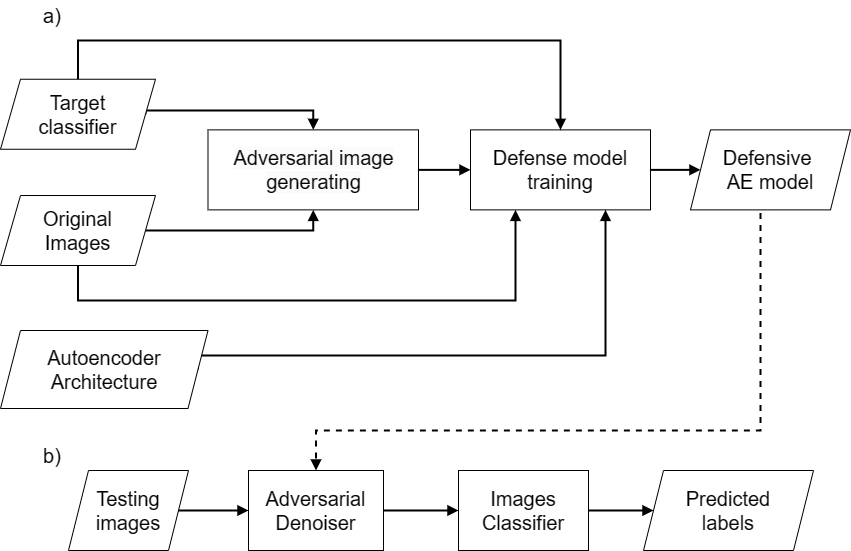
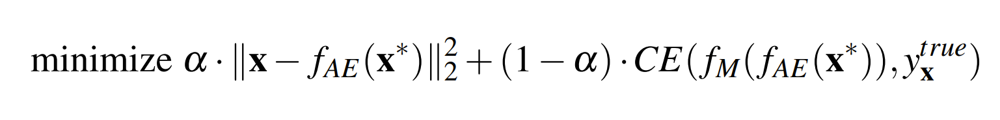

# AE4AD - Autoencoder for Adversarial Defense
This is the code repository for AE4AD - Autoencoder for Adversarial Defense. - [Report]([https://link-url-here.org](https://www.overleaf.com/read/gdyzfnyhnvvr))

AE4AD is a tool to build adversarial (de-noise) defense models for image classification tasks.

The primary goal of this project is to develop a tool that can effectively defend against various adversarial attacks. To achieve this, the tool uses different types of un-targeted adversarial generation methods, such as FGSM, BIM, MI-FGSM, CW, Gauss, to augment the data. 
Then, adversarial and original data is used to train an autoencoder model that learns to reconstruct the original image from its adversarial counterpart. This process effectively removes the adversarial perturbations from the image, making classifiers more robust to adversarial attacks.

The AE4AD tool provides a config-note interface to train and test the autoencoder model on some image classification datasets such as MNIST, Fashion MNIST, CIFAR-10. It also allows users to generate adversarial examples using different attack methods and test the robustness of their models against these attacks.

## Proposal

The goal of adversarial image generating phase is to produce a set of adversarial images using different adversarial data generation methods, creating a large dataset of diverse adversarial images with distinct characteristics that can be used as input for training defense model.

In the training phase of the Autoencoder model, the adversarial image set generated in the previous phase is used along with the original image set to train the defense model. The training dataset is denoted as XAE = {(x', x, y)} - (input image, desired output image, desired output label) with x as the original image or as the adversarial image. The proposed method trains an Autoencoder model that learns to reconstruct data, filter, and minimize the impact of adversarial noise in the training dataset. This model needs to ensure that the reconstructed images are not too different from the desired output and are predicted by the model with results close to the desired original label.

### Objective function

## Experiment

### Classifier
Accuracy of classifiers:

| Model (Dataset)       | Train Set      | Test Set     |
|-----------------------|----------------|--------------|
| MNIST                 | 99.31          | 99.21        |
| Fashion MNIST         | 96.53          | 91.15        |
| CIFAR-10              | 97.08          | 91.19        |

### Adversarial generation
Configurations of adversarial image generation:

| Model (Dataset) 	| FGSM       	| BIM                  	| MI-FGSM                                        	| CW L2             	|
|-----------------	|------------	|----------------------	|------------------------------------------------	|-------------------	|
| MNIST           	| e = 0.0784 	| e = 0.0039 T = 20 	| e = 0.0039 T = 30 mu = 0.9 E = 0.784  	| K = 0 T = 1000 	|
| Fashion MNIST   	| e = 0.0627 	| e = 0.0039 T = 20 	| e = 0.0039 T = 30 mu = 0.9 E = 0.784  	| K = 0 T = 1000 	|
| CIFAR-10        	| e = 0.0039 	| e = 0.0039 T = 10 	| e = 0.0039 T = 10 mu = 0.9 E = 0.0392 	| K = 0 T = 1000 	|

Adversarial success rate:

| Model (Dataset) 	| FGSM  	| BIM   	| MI-FGSM 	| CW L2  	|
|-----------------	|-------	|-------	|---------	|--------	|
| MNIST           	| 34.27 	| 56.54 	| 55.27   	| 99.95  	|
| Fashion MNIST   	| 72.97 	| 93.15 	| 92.27   	| 99.97  	|
| CIFAR-10        	| 46.56 	| 99.93 	| 96.01   	| 100.00 	|

### Defense result:

| Model (Dataset) 	| FGSM  	| BIM   	| MI-FGSM 	| CW L2 	|
|-----------------	|-------	|-------	|---------	|-------	|
| MNIST           	| 98.26 	| 99.11 	| 99.14   	| 99.86 	|
| Fashion MNIST   	| 91.34 	| 91.96 	| 92.47   	| 95.58 	|
| CIFAR-10        	| 80.69 	| 83.24 	| 79.69   	| 92.24 	|

